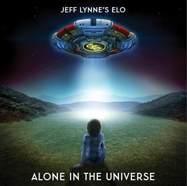
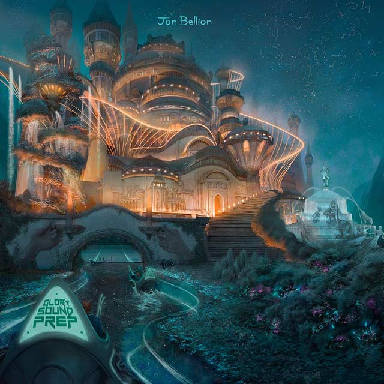

# claridelune's profile 🌙

```zsh
> neofetch
```

 

```
claridelune@github
-------------------------
OS: Manjaro Linux x86_64
Shell: zsh 5.9
Languages: C++, python,
           javascript, shell
Learning: AI, Biocomputing,
          Robotics
Hobbies: Music, Guitar, Writing
```

<table width="100%">
    <thead>
        <tr>
            <th></th>
            <th></th>
        </tr>
    </thead>
    <tbody>
        <tr>
            <td>
                
                <strong>When I Was a Boy</strong> <br>
                <em>Electric Light Orchestra</em>
            </td>
            <td> 🌠 In pursuit of dreams, life finds meaning</td>
        </tr>
        <tr>
            <td>
                
                <strong>Mah's Joint</strong> <br>
                <em>Jon Bellion, Quincy Jones</em>
            </td>
            <td>🎵 Melodies, music, adventures, paths to follow</td>
        </tr>
        <tr>
            <td>
                
                <strong>Saturno (Todo Vuela)</strong> <br>
                <em>La Casa Azul</em>
            </td>
            <td>🪐 Time's rush; life's fleeting dance</td>
        </tr>
        <tr>
            <td>
                
                <strong>Lukaamaari</strong> <br>
                <em>Sajjan Raj Vaidya</em>
            </td>
            <td>🌌 When the noise fades, myriad worlds whisper</td>
        </tr>
        <tr>
            <td>
                
                <strong>Sueños de sal</strong> <br>
                <em>Oscar Navarro</em>
            </td>
            <td>🎈 Playing, experimenting, driven by boundless curiosity</td>
        </tr>
    </tbody>
</table>
